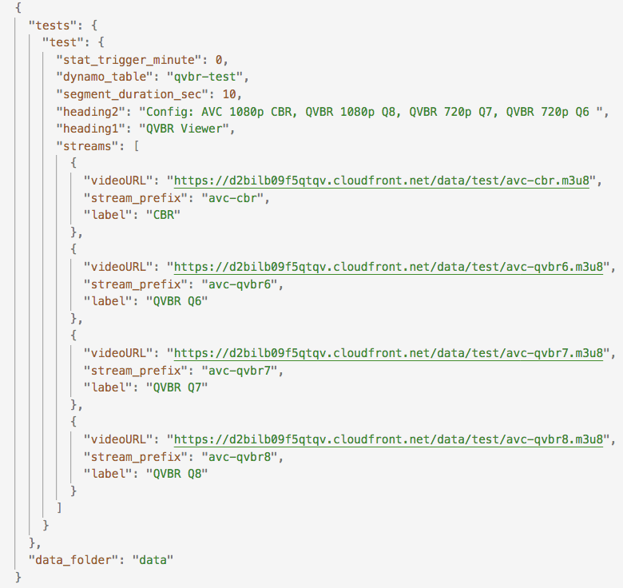
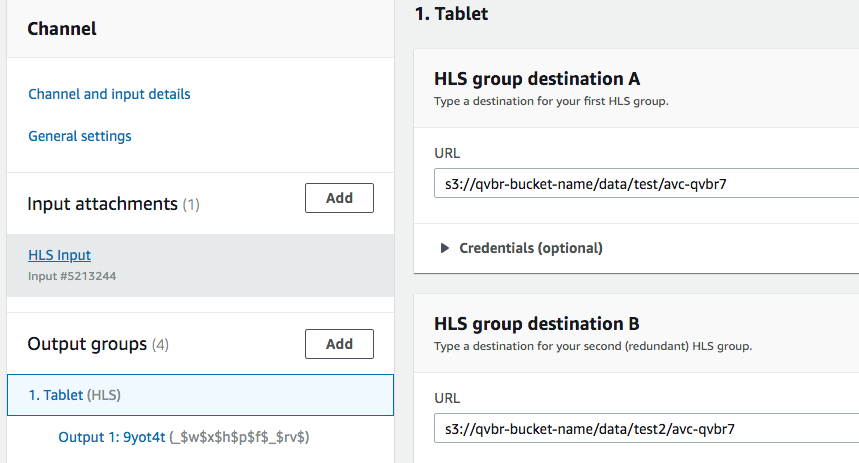
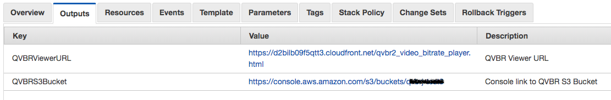
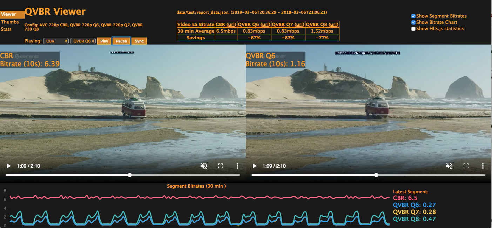

# AWS Elemental Quality-Defined Variable Bitrate (QVBR) Viewer - Live

Quality-defined variable bitrate (QVBR) control is a new rate control mode that is currently available in the AWS Elemental MediaLive and AWS Elemental MediaConvert, as well as the AWS Elemental Live and AWS Elemental Server products. To learn more QVBR in MediaLive, check out [this page](https://docs.aws.amazon.com/medialive/latest/ug/creating-a-channel-step6.html). 

The visualization tool provided here ultimately produces a webpage that shows the comparative bitrate usage of the HLS videos generated using different QVBR levels against tradional rate control settings like CBR. The information is updated dynamically on the page as content comes in real-time, allowing the user to observe the bitrate savings one can get from using QVBR mode. A statistics page shows hourly bitrate averages over a week's period. The viewer also includes a side-by-side player that allows the user to watch the same content encoded with different rate control modes for a quick visual quality comparison.  

## Limitations and Assumptions

1. The tool doesn't automatically generate any of the video content for you. Instructions are provided on how to manually do this. 
1. An Amazon S3 private bucket is created by the CloudFormation template where the video you generate is expected to be written for analysis.
1. The tool supports HLS up to HD. 
1. The user is familiar with the AWS console and has rights to deploy templates using the AWS CloudFormation service.
1. The user is familiar with creating AWS Elemental MediaLive inputs and channels.
1. The user has access to a Live source that's going to be used as an AWS Elemental MediaLive inputs. See [supported input types](https://docs.aws.amazon.com/medialive/latest/ug/inputs-supported-containers.html).
1. The channel template provided here is for creating an AWS Elemental MediaLive channel. However, they can be used as a starting point to create an equivalent AWS Elemental Live event. MediaLive and QVBR guidelines can be found [here](https://docs.aws.amazon.com/medialive/latest/ug/creating-a-channel-step6.html). 

## Deploy the Live Viewer

### Launch the CloudFormation Template
The CloudFormation template is currently hosted in us-west-2.

1. Launch the template [here](https://console.aws.amazon.com/cloudformation/home?region=us-west-2#/stacks/new?templateURL=https://s3-us-west-2.amazonaws.com/rodeolabz-us-west-2/qvbr/live/qvbr2_live_template.json).
1. Click **Next**.
1. Provide a Stack name and S3 bucket name of your choosing.
1. Click **Next** in the next two pages.
1. Select the “I acknowledge that AWS CloudFormation might create IAM resources” checkbox. 
1. Click **Create**.

## Verify and Update the Config File
1. Once the template has been completely deployed, select the **Output** of the stack. Click on the console link to QVBR S3 Bucket to inspect the newly created private bucket. 
1. In the bucket, download and inspect the default config file (`qvbr2_config.json`). It should reflect the settings of the HLS streams that are going to be written to the bucket. **The paths and stream prefixes used in this config file must match the settings of the MediaLive channel you'll be creating.**

    

## Create and Start an AWS Elemental MediaLive Channel
The MediaLive channel template will generate 4 outputs that use CBR, QVBR 6, QVBR 7, and QVBR 8 rate control settings. The destination paths should match the config file (`qvbr2_config.json`) that has been automatically generated in the previous section. 
1. Create an AWS Elemental MediaLive input. Instructions [here](https://docs.aws.amazon.com/medialive/latest/ug/create-input.html).
1. Use the MediaLive channel template provided [here](MediaLiveQVBRChannelTemplate.json) to create your channel. Instructions [here](https://docs.aws.amazon.com/medialive/latest/ug/creating-channel-template.html)
1. Under **Channel and input details**, make sure to select an IAM role that your channel is going to use. More information on MediaLive IAM roles [here](https://docs.aws.amazon.com/medialive/latest/ug/role-and-remember-arn.html).
1. Update your channel to use the input you generated.
1. Go through each of the output groups and update the channel's output destinations to write to your S3 bucket by replacing `qvbr-bucket-name` with your bucket name. 
 
    

1. Ensure that the paths and stream prefixes specified in the channel match the settings in the config file generated in the previous step. 
1. Start your channel.

### Verify Data is Present in the Bucket
1. On the AWS Console, navigate back to your S3 bucket.
1. Confirm that a `data/test` directory is present and that HLS manifest and video segments are being written.
1. After a minute or two, you should also see a `report_data.json` file in the same directory that shows manifest and segments are being analyzed.

    

## Launch the QVBR Bitrate Viewer Page
1. Navigate back to the CloudFormation console. 
1. Under the output tab of the template launched earlier, copy and paste the QVBR URL Viewer to a web browser.
    

1. You should see a page like below that shows you've successfuly deployed the QVBR Bitrate Viewer.

    

### Things to Note About the Viewer
1. It takes CloudFront a few minutes to get its settings completely propagated. Give it 5 minutes or so before trying to hit the viewer page again.
1. If the viewer is accessible but there's no data, this means that the report data hasn't been generated yet.  

## Testing a New Live Video Source
To reuse the same test configuration but on a different live source, you may simply switch out the input you are using.
1. Stop your MediaLive channel. 
1. Create a new input, and associate the new input to your MediaLive channel. 
1. Restart the channel.
1. The viewer should automatically pick up and analyze the new segments being generated. 

## Running Multiple Tests Concurrently
The default config automatically generated by the CloudFormation template only creates one set of tests (under the `data/test` directory), but you may run multiple tests at once. For example you may run one set of AVC tests and another set of HEVC tests all at the same time. To do this:

1. After successfully deploying the CloudFormation template, and **before** you start your MediaLive channel, download and edit the generated config (qvbr2_config.json) from your S3 bucket, and add another set of tests. As an example, see [this sample config with comments](qvbr_sample_config_with_multiple_tests.json).
1. Upload the config file back to your S3 bucket.
1. Edit and add HLS output groups to your MediaLive channel such that:
    * The output stream is written to: _s3://[`QVBRS3BucketName`]/data/[` new_test_name`]_ where `new_test_name` is a name of your choice and must match the one you provided in the config file.
    * For each bitrate output, the **stream prefix** matches the one in the config file (eg. _avc-qvbr7_). 
    * The **stream prefix** does not contain an underscore character (eg. _avc_qvbr7_ is not allowed).
    * The **segment name** has a timestamp. That is, it is using `_$dt$` as the Segment Modifier. 
    * There are no subfolders under the [`new_test_name`] directory.
1. Start your MediaLive channel.
1. The viewer will only serve up data from the first set of tests (ie. from the default test directory). In order to view data from your other set of tests, grab your QVBR URL viewer link from the CloudFormation template, and append the specific report data to be used. 

    Example: _https://d2bilb09f5qtt3.cloudfront.net/qvbr2_video_bitrate_player.html?data=data/**new_test_name**/report_data.json_

## Resource Cleanup
Once you're done running your tests, and no longer need any of the data, clean up all the AWS resources used so as not to incur any unintended charges.
1. From the AWS CloudFormation console, select the stack created by the template you launched. Under **Actions**, select **Delete Stack**. This will delete the CloudFront resource, as well as the lambdas and IAM roles generated by the template.
1. Stop the MediaLive channel. Once status is Idle, delete the channel.
1. Delete the MediaLive input associated with your channel, as well as any other inputs created during testing.
1. From the S3 console, delete the bucket created by your CloudFormation stack. If you have a MediaLive channel running and actively writing to this bucket, you will not be able to delete the bucket successfully.